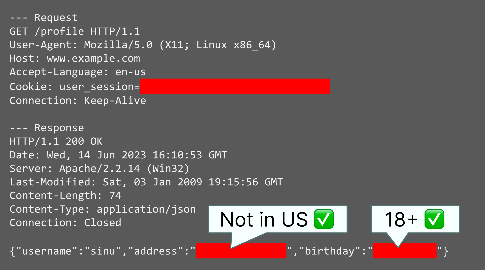
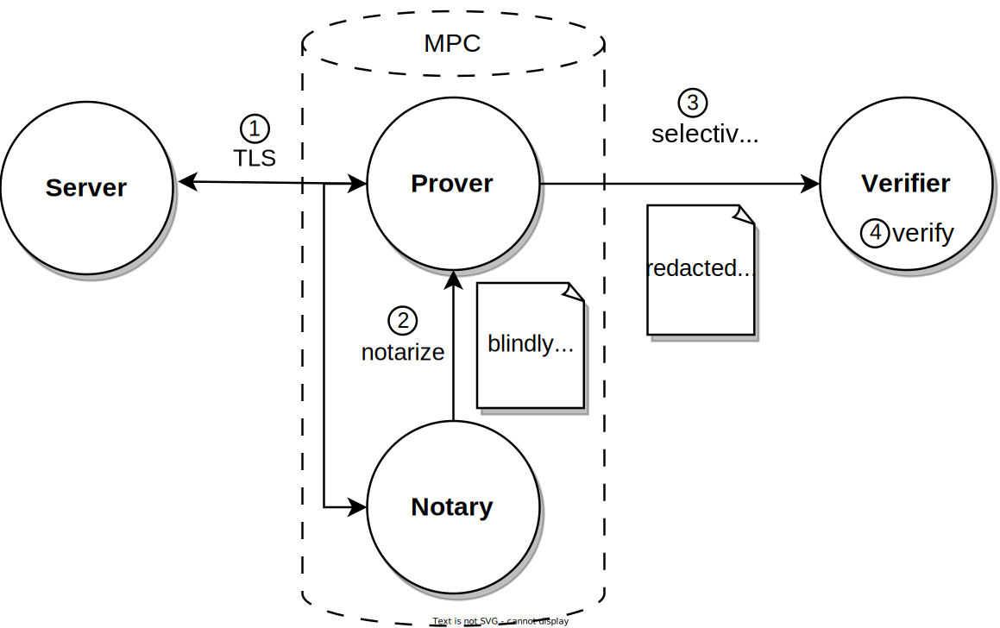
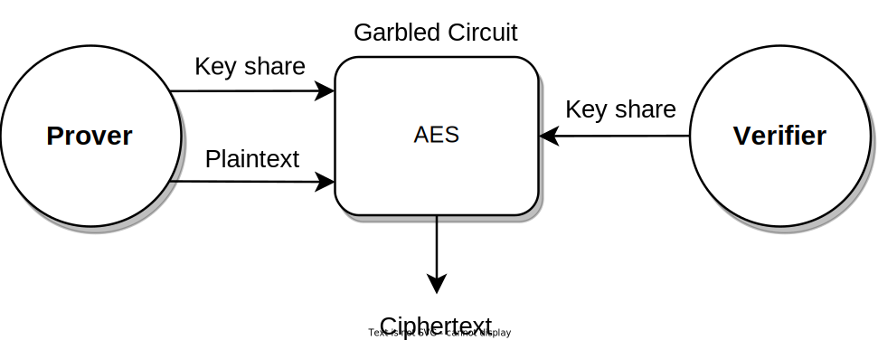
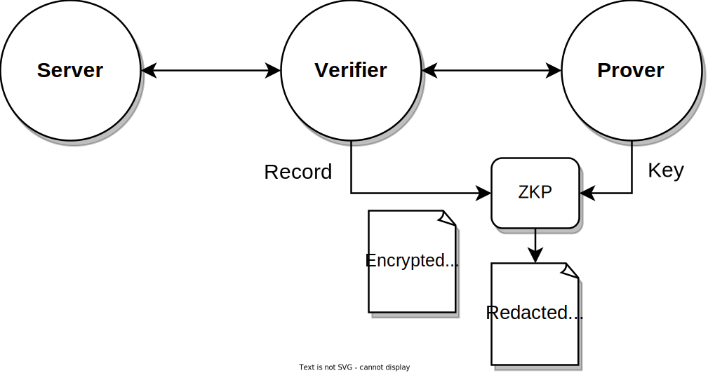

# Introduction

TLSNotary is a protocol which allows people to export data from any web application and prove facts about it to a third-party in a privacy preserving way. 

<!-- truncate -->

It enables privacy-preserving **data provenance and data portability**, empowering users to share their data with others as they see fit.

To do this, TLSNotary leverages secure multi-party computation (MPC) to authenticate data communicated between a Prover and a TLS-enabled web server, as depicted in Figure 1.

|  |
| :----------------------------------: |
|      Figure 1: Simple Overview       |

Importantly, the protocol supports *selective disclosure* of data to a Verifier. This way the Prover can keep secrets hidden, such as passwords or any other information not necessary to prove some specific statement.

Selective disclosure may involve simple redactions, or more advanced techniques such as a zero-knowledge proof that a number in the data is within a specific range, without disclosing its exact value.

|    |
| :----------------------------: |
| Figure 2: Selective Disclosure |

The TLSNotary protocol presents a compelling alternative to other solutions for sharing data for the following reasons:

-  It does not require the Server to integrate data sharing into its application, such as OAuth.
-  The act of disclosing data to a third-party is not known to the Server, nor can it be practically censored.
-  The Prover has very fine-grained control over *exactly* what data is disclosed to the Verifier.
-  The Verifier does not need to trust that the Prover is honest, the authenticity of the data comes with cryptographic assurances.

For more introductory information, see our [website](https://tlsnotary.org) which also includes some example use-cases and a link to our (work-in-progress) documentation.

TLSNotary is a project under the [Privacy & Scaling Explorations (PSE)](https://pse.dev) team at the Ethereum Foundation. PSE is a multi-disciplinary team exploring how programmable cryptography can be applied to enhance privacy and scale trust-minimized systems.

## General-purpose Verifier: Notary

We envision an ecosystem of general-purpose verifiers, called Notaries, which help users take back control of their data in a privacy preserving way.

We find it important that our protocol supports hiding the identity of the Server, as well as hiding virtually *all information* about the application the Prover is interacting with.

A Notary is a special kind of verifier which allows the Prover to do just that. It decouples the process of proving the authenticity of data from the process of selective disclosure. Notaries being completely blind of context preserves neutrality, and helps mitigate bad incentives or censorship which could arise in circumstances with an application-specific Verifier.

Of course, we still need to support selective disclosure of the data to _someone_. How do we do that if a Notary is to know nothing? Fortunately this is still possible to do in a relatively simple way.

|  |
| :---------------------------: |
|      Figure 3: Notaries       |

During the MPC, efficient commitments to the data are generated and we can reuse them for selective disclosure. The Notary simply signs an attestation which includes these commitments, as well as a commitment to the Server identity, which the Prover can store and carry around (in a data backpack? 🎒). Later the Prover can use this attestation to selectively disclose data to someone else.

This enables users to privately export data with the help of a neutral third-party, receiving an attestation to its authenticity. Using these attestations, other verifiers can accept proofs if they consider the attesting Notary trustworthy. Of course, a verifier can require attestations from multiple Notaries, which reduces to a 1-of-N trust assumption!

# How It Works

As mentioned in the introduction, TLSNotary leverages MPC to provide cryptographic assurances that the Prover can not cheat or lie about the communications with the Server. Additionally, the Verifier can not tamper with the connection as to leak secrets or cause malicious state updates within the application. In other words, the protocol is designed to be [malicious secure](https://en.wikipedia.org/wiki/Secure_multi-party_computation#Security_definitions) for both parties.

The Prover and Verifier securely secret-share the TLS session keys such that neither party is able to unilaterally send or receive messages from the Server. This ensures the authenticity of data, while hiding the plaintext from the Verifier.

Under the hood we employ primitives such as [Garbled Circuits](https://en.wikipedia.org/wiki/Garbled_circuit), [Oblivious Transfer](https://en.wikipedia.org/wiki/Oblivious_transfer#1%E2%80%932_oblivious_transfer) and Oblivious Linear Evaluation (OLE) to do this. These primitives have historically suffered from high resource costs in terms of both compute and bandwidth requirements, particularly in adversarial settings which require malicious security. Fortunately, over the past decade or so, there have been many breakthroughs in concrete efficiency which have brought MPC closer to a practical reality for many applications.

Even so, implementing a protocol like TLSNotary pushes up against the bounds of practical feasability in the malicious setting.

For example, the dominant cost of our protocol comes from performing binary computation using Garbled Circuits. Modern techniques such as free-XOR[^1] and half-gates[^2] still comes with a cost of ~200kB of communication to evaluate a single AES block (the most widely used cipher in TLS) in the semi-honest setting. Extrapolating, it costs ~50MB to encrypt only 4kB of data! Doing so with malicious security can easily add an order of magnitude to this cost figure, rendering such pursuits practically infeasible.

|                 |
| :-------------------------------------: |
| Figure 4: 2PC AES with Garbled Circuits |

Naturally, we require the TLSNotary protocol to be secure against malicious adversaries. We must find a way to make it malicious secure, but malicious security is expensive. Wat do?

Before we get into how we solved this problem for our protocol, we wanted to highlight a viable alternative approach which we decided not to take.

## Alternative: Proxy Mode

An alternative approach to this problem is to side-step the need to use expensive MPC techniques and stick to cheaper approaches which operate in the zero-knowledge setting. Or more specifically, the setting where only 1 party has private inputs (the Prover).

Rather than having the Prover connect directly to the Server and operating the connection cooperatively with the Verifier, instead, the Verifier is situated in-between the Prover and Server, as shown in Figure 5.

|  |
| :-----------------------------: |
|      Figure 5: Proxy Mode       |

In this configuration, the Verifier acts as a proxy and simply records the encrypted data being communicated between the Prover and Server. Afterwards, the Prover can selectively disclose parts of the data with a zero-knowledge proof using their TLS keys as private inputs.

This approach is quite viable and is one which other teams are pursuing. However, it comes with a different set of security assumptions. Rather than relying just on cryptographic assumptions, the proxy approach also makes _network topology_ assumptions. It assumes that the Verifier has a direct connection to the Server, and that a malicious Prover can not bypass or otherwise insert themselves in-between the Verifier and Server. As the Prover holds the full TLS session keys, if they are able to invalidate this assumption it completely breaks the integrity of the protocol.

As explained in the above [section on Notaries](#general-purpose-verifier-notary), we find the ability to hide the identity of the Server from the Verifier important. This is clearly not possible with this model.

To be fair, there are viable mitigations to network attacks and in many scenarios these assumptions are acceptable. We look forward to seeing what is unlocked with the application of this model, as the simplicity and efficiency of this approach is enticing.

However, we decided to pursue the MPC approach and found a way to practically achieve malicious security without making such network assumptions.

## Achieving Practicality with MPC

A key observation enabling our approach is that all private inputs from the Verifier in the MPC are ephemeral. That is, after the TLS connection has been terminated the Verifier can reveal their share of the TLS session keys to the Prover without consequence. Moreover, multiple bits of the Verifier's inputs can be leaked prematurely without compromising security of the overall protocol.

Malicious secure protocols typically aim to prevent *any* leakage of any parties inputs, employing techniques such as authenticated garbling or variants of cut-and-choose, which add significant compute and/or communication overhead.

For our needs, we implemented a novel\* variant of so-called Dual Execution, which we dubbed Dual Execution with Asymmetric Privacy (DEAP). Is there a better name for it? Probably. Nonetheless, you can read our informal [explanation of it here](https://docs.tlsnotary.org/mpc/deap.html).

The jist of it is this: During the TLS session one party, the Prover, acts as the Garbler while also committing to their inputs prior to learning the output of the circuit. Later, these commitments are used to prove the Prover acted honestly (or at least leakage was statistically bounded), and aborting otherwise.

Some key take aways of this approach:

- Garbled circuits on their own are secure against a malicious evaluator. The Verifier, acting as the evaluator, can not cheat or otherwise corrupt the output without detection. This ensures the privacy and integrity of the data to the Prover during the TLS session.
- In the final phase of DEAP the Verifier opens all their inputs to the Prover. This allows the Prover to check the Verifier has behaved honestly and ensures *no leakage* of the private data, contrary to the leakage inherent in the equality check of standard Dual Execution.

Exploiting the rather niche privacy requirements of our protocol allows us to achieve malicious security without the typical overhead that comes with it.

In fact, the final phase of DEAP reduces to the much cheaper zero-knowledge scenario. While we currently use garbled circuits for this ZK phase, as pioneered in JKO13[^4], we can take advantage of even more efficient ZK proof systems. We're planning on switching to new methods known as VOLE-based IZK[5], which boast over 100x reduction in communication cost compared to garbled circuits. Doing so will make our protocol marginally more expensive than the semi-honest security setting.

Using the efficient VOLE-based IZK in combination with the simple trick of deferring decryption until after the TLS connection is closed, **TLSNotary will achieve efficiency similar to that of the proxy mode configuration**. Specifically, we do not need to utilize expensive Garbled Circuits for proving Server response data, which is typically the dominant cost.

\* This approach has recently also been articulated by XYWY23[^3]

## A note on Oracles

While the TLSNotary protocol can be used to construct a [blockchain oracle protocol](https://ethereum.org/en/developers/docs/oracles/), that is not its primary purpose, especially in regards to _public_ data feeds. TLSNotary is best suited for contexts which require proving of _private_ data which is typically only accessible to an authenticated user. Moreover, because it is an _interactive_ protocol, it must be run by an off-chain Verifier. Bringing data on-chain still requires a trust assumption, ie an attestation from a trusted party(s).

# Where We Are

An alpha version of the TLSNotary protocol is [available for testing](https://github.com/tlsnotary/tlsn). We welcome folks to start playing around with it, including trying to break it! We have some examples available and a quick start to get you running.

The underlying MPC primitives are contained in a separate project named [`mpz`](https://github.com/privacy-scaling-explorations/mpz) which is intended to evolve into a general-purpose MPC stack.

Both codebases are 100% Rust 🦀 and compile to WASM targets with an eye on deployment into browser environments.

All our code is and always will be open source! Dual-licensed under Apache 2 and MIT, at your choice.

We've invested effort into making sure our code is modular and capable of evolving. We hope that others may find some of the components independently interesting and useful. Contributions are welcome!

## Current Limitations

While we're excited to start experimenting with TLSNotary, we acknowledge the work we have ahead of us.

Below are some important points to consider:

- Our protocol currently lacks security proofs and has not been audited.
- It is functional but under active development.
- Until we integrate VOLE-based IZK, it is only practical to prove data volumes in the **low kB** range (largely dependent on network bandwidth between the Prover and Verifier). This works for many use-cases involving API queries for succinct representations of data, eg. identity information.
- Selective disclosure *tooling* is currently limited to simple redactions.

# Roadmap

We have a number of items on our roadmap that we are tackling across a few different areas.

## Core Protocol (MPC TLS)

In addition to standard things like better tests, audits and documentation, we have a number of improvements in mind for our core protocol:

- The security proofs for the protocol we use for OT extension, KOS15[^6], was called into question around the time we adopted and implemented it. We're due to replace it with the more recent SoftSpokenOT protocol, Roy22[^7]
- Implement and integrate VOLE-based IZK. As mentioned earlier, this is a critical piece which will significantly boost efficiency and make proving larger data volumes (MBs) practical.
- Improve the P256 point-addition protocol used in the ECDHE key exchange, as well as the protocol for GHASH used in AES-GCM. We implement both using Gilboa-style (Gil99[^8]) OLE with additional consistency checks, but a more efficient approach was recently demonstrated by XYWY23[^ 3].
- Add support for the ChaCha20-Poly1305 ciphersuite. ChaCha20 has ~50% lower communication cost compared to AES when executed in MPC.
- TLS 1.3 support.

## Selective Disclosure

Being able to prove the authenticity of data is one thing, but it's important that selective disclosure tooling is available for developers to easily build privacy preserving applications.

Below are some items we will be prioritizing:

- Gadgets and examples for using the commitments with SNARKs. We intend to make it easy to integrate SNARKs using tooling such as Circom.
- Support proving arbitrary statements to the Verifier with IZK. Presently, we only provide tools for simple redactions out of the box.
- Tooling for common application contexts, eg. HTTP, and JSON. Web applications do not represent data in formats friendly to ZK proofs, so it can be quite burdensome to work with. Developers need good abstractions at their disposal for working with these formats.

## Infrastructure

### Reference Notary Server

We're building a reference [Notary server implementation](https://github.com/tlsnotary/notary-server) which enables anyone to spin up a Notary and start attesting!

This implementation will also serve as a reference for building application-specific verifiers.

### Browser extension

Desktop applications have mostly fallen out of style, which is a shame because building cryptography applications in the browser is *difficult*! But we work with what we've got. So we're building a [web extension](https://github.com/tlsnotary/tlsn-extension) to let people run the TLSNotary protocol in their browser using WASM.

It is still in very early stages, but the plan is to provide some UI conveniences for users, and a plugin system for developers to build proving flows in a sandboxed environment. We envision an open ecosystem of these plugins which users can select depending on their needs. This no doubt will come with some security challenges!

# Join Us!

Come find us in our [public Discord server](https://discord.gg/9XwESXtcN7), and tune in for further updates on [Twitter](https://twitter.com/tlsnotary).

We're looking forward to seeing all the great privacy-centric applications folks can come up with!

# References

[^1]: Kolesnikov, V., Schneider, T.: Improved garbled circuit: Free XOR gates and applications. In: ICALP 2008, Part II (2008)
[^2]: Zahur, S., Rosulek, M., and Evans, D.: Two Halves Make a Whole Reducing Data Transfer in Garbled Circuits using Half Gates. In: 34th Eurocrypt, Sofia, Bulgaria, April 2015
[^3]: Xie, X., Yang, K., Wang, X., Yu, Y.: Lightweight Authentication of Web Data via Garble-Then-Prove
[^4]: Jawurek, M., Kerschbaum, F., Orlandi, C.: Zero-Knowledge Using Garbled Circuits or How To Prove Non-Algebraic Statements Efficiently.
[^5]: Baum, C., Dittmer, S., Scholl, P., Wang, X.: SoK: Vector OLE-Based Zero-Knowledge Protocols
[^6]: Keller, M., Orsini, E., Scholl, P.: Actively Secure OT Extension with Optimal Overhead
[^7]: Roy, L.: SoftSpokenOT: Communication–Computation Tradeoffs in OT Extension
[^8]: Gilboa, N.: Two Party RSA Key Generation. In: Advances in Cryptology - Crypto '99