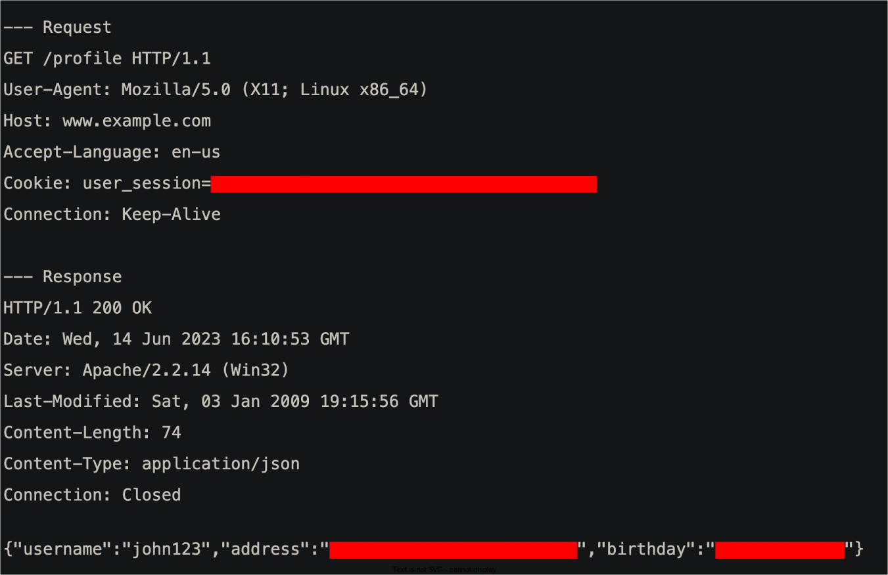

# Verification

A `Verifier` receives the following from the `User`:

<!-- // TODO will explain each -->

- domain name (e.g. "tlsnotary.org")
- signed `Session Header`
- openings to the commitments (the plaintext which the User committed to)
- handshake_data which consists of:
  - server certificate
  - key exchange details
  - client and server random

and performs the following steps to verify the commitments:

<!-- // you can see these steps in tlsn/tlsn-core/tests/api.rs -->

- verify that `Session Header` was signed by the Notary
- verify handshake_data against handshake_commitment
- verify validity of `server certificate` for the `domian name`
- verify that `key exchange details` were signed by the `server certificate`

- use encoder_seed to re-generate encodings and re-create a commitment for the opening plaintext 
(maybe this step needs to be spelled out in more detail)
- use `merkle_root` to check that this re-created commitment is in the Merkle tree

To summarize: the `Verifier` will only learn those portions of the TLS session transcript which the `User` chose to reveal. The portions which were not revealed (`User`'s private data) will appear to the `Verifier` as redacted. Here is an example of what the `Verifier` output may look like:

<!-- // paste here a picture of an HTTP request with redacted fields -->

